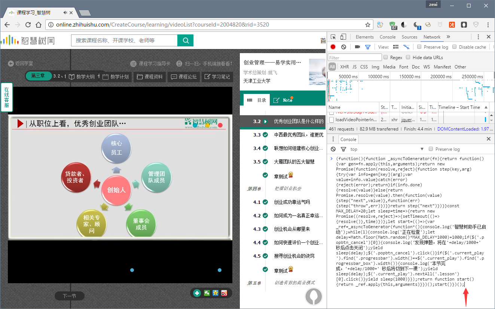

# ZhiHuiShu-Assistant

智慧树网课辅助脚本

## 特性

- 自动关闭网课中弹题
- 自动切换下一节、下一章
- 自动点击之前，会随机等待 **0 ~ 60** 秒，模拟人类操作延迟

## 使用说明

### 浏览器

chrome、或非IE浏览器的极速模式。

### 操作步骤

1. 复制 **main-es5.js** 内的全部代码
2. 打开 **智慧树** 网课播放的页面
3. 按下 **F12** 打开开发者窗口
4. 找到 **Console** 面板
5. 按下 **ctrl+v** 贴入代码
6. 按下 **回车**

看到 `智慧树助手已启动`，说明操作正确。

## 协议

MIT